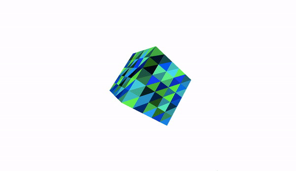

# cube3js
Rotating cube using Three.js 💠
## Prerequisites
- Three.js

## Result
### Just revolving cube (cube1.html)

### Interactable cube with possibility to change it's spead (cube2.html)

## License
[MIT License](https://choosealicense.com/licenses/mit/)
